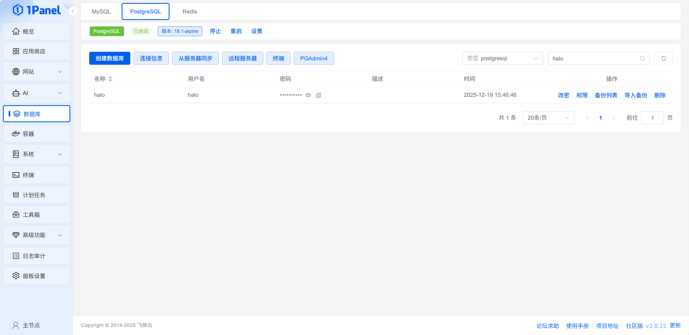

# 1Panel 使用 Docker Compose 部署 Halo 博客系统

本文介绍如何在 1Panel 面板中通过 Docker Compose 编排方式安装和部署 Halo 博客系统。

<!-- more -->

## 前置准备

- 已安装 1Panel 管理面板
- 服务器已安装 Docker 和 Docker Compose
- 具备基本的 Linux 命令行操作能力

## 步骤一：配置 Docker 镜像源（可选）

为了加速国内下载速度，建议配置 Docker 镜像源。

### 操作步骤

1. 进入 **容器 → 配置 → 全部配置** 页面


2. 添加以下镜像源配置：

```json
{
  "registry-mirrors": [
    "https://docker.mirrors.ustc.edu.cn",
    "https://hub-mirror.c.163.com",
    "https://docker.1panel.live",
    "https://dc.j8.work",
    "https://docker.m.daocloud.io",
    "https://dockerproxy.com",
    "https://docker.mirror.sutc.edu.cn",
    "https://docker.nju.edu.cn"
  ]
}
```

::: tip 提示
配置后需要重启 Docker 服务才能生效。
:::

## 步骤二：安装 PostgreSQL 数据库

Halo 需要使用 PostgreSQL 数据库存储数据。

### 安装数据库

1. 在 **应用商店** 中搜索 `PostgreSQL`


2. 点击安装，等待安装完成

### 创建数据库

安装完成后，创建名为 `halo` 的数据库：



::: warning 注意
请记住数据库的用户名和密码，后续配置中需要使用。
:::

## 步骤三：创建 Docker Compose 编排

### 创建编排任务

1. 进入 **容器 → 编排 → 创建编排** 页面


2. 使用以下 `docker-compose.yml` 配置：

```yaml
version: "3.8"

services:
  halo:
    image: registry.fit2cloud.com/halo/halo:2.21
    container_name: halo
    restart: on-failure:3
    depends_on:
      halodb:
        condition: service_healthy
    networks:
      - halo_network
    volumes:
      - ./halo2:/root/.halo2
    ports:
      - "8090:8090"
    healthcheck:
      test: ["CMD", "curl", "-f", "http://localhost:8090/actuator/health/readiness"]
      interval: 30s
      timeout: 5s
      retries: 5
      start_period: 30s
    environment:
      # JVM 参数，可根据服务器内存调整
      JVM_OPTS: -Xmx512m -Xms256m
    command:
      # 数据库连接配置
      - --spring.r2dbc.url=r2dbc:pool:postgresql://halodb:5432/halo
      - --spring.r2dbc.username=halo
      # 数据库密码，与下方 POSTGRES_PASSWORD 保持一致
      - --spring.r2dbc.password=openpostgresql
      - --spring.sql.init.platform=postgresql
      # 外部访问地址，请修改为实际的域名或 IP
      - --halo.external-url=http://192.168.101.6:8090/

  halodb:
    image: postgres:15.4
    container_name: halo-postgres
    restart: on-failure:3
    networks:
      - halo_network
    volumes:
      - ./db:/var/lib/postgresql/data
    healthcheck:
      test: ["CMD", "pg_isready"]
      interval: 10s
      timeout: 5s
      retries: 5
    environment:
      POSTGRES_PASSWORD: openpostgresql
      POSTGRES_USER: halo
      POSTGRES_DB: halo
      PGUSER: halo

networks:
  halo_network:
    driver: bridge
```

### 配置说明

| 参数 | 说明 |
|------|------|
| `halo:2.21` | Halo 版本号，可更换为最新版本 |
| `JVM_OPTS` | Java 堆内存设置，根据服务器配置调整 |
| `8090:8090` | 端口映射，左侧为宿主机端口 |
| `halo.external-url` | Halo 外部访问地址，必须正确配置 |
| `POSTGRES_PASSWORD` | 数据库密码，请修改为强密码 |

::: danger 安全提示
生产环境中请修改默认密码 `openpostgresql` 为复杂密码！
:::

## 步骤四：启动服务

1. 创建编排任务后，点击 **启动** 按钮
2. 等待容器启动完成（首次启动需要下载镜像，耗时较长）
3. 访问 `http://<你的IP>:8090` 进行初始化配置

## 验证部署

### 检查容器状态

```bash
# 查看容器运行状态
docker ps | grep halo

# 查看 Halo 日志
docker logs -f halo
```

### 访问 Halo

浏览器访问：`http://<服务器IP>:8090`

首次访问会进入初始化向导，按照提示完成配置即可。

## 常见问题

### 1. 容器启动失败

**解决方法**：
- 检查端口 8090 是否被占用
- 查看容器日志：`docker logs halo`
- 确认数据库连接信息是否正确

### 2. 无法访问 Halo

**解决方法**：
- 检查防火墙是否开放 8090 端口
- 确认 `halo.external-url` 配置正确
- 检查容器是否正常运行

### 3. 数据库连接失败

**解决方法**：
- 确认 PostgreSQL 容器已启动
- 检查数据库用户名和密码
- 确认网络 `halo_network` 配置正确

## 后续优化

### 配置域名访问

使用 Nginx 反向代理配置域名：

```nginx
server {
    listen 80;
    server_name blog.yourdomain.com;
    
    location / {
        proxy_pass http://localhost:8090;
        proxy_set_header Host $host;
        proxy_set_header X-Real-IP $remote_addr;
        proxy_set_header X-Forwarded-For $proxy_add_x_forwarded_for;
        proxy_set_header X-Forwarded-Proto $scheme;
    }
}
```

### 启用 HTTPS

使用 Certbot 申请免费 SSL 证书：

```bash
sudo certbot --nginx -d blog.yourdomain.com
```

## 总结

通过 1Panel 和 Docker Compose 部署 Halo 博客系统具有以下优点：

- ✅ 部署简单，无需复杂配置
- ✅ 容器化管理，方便维护
- ✅ 数据持久化，不担心数据丢失
- ✅ 易于升级和迁移

现在你已经成功部署了 Halo 博客系统，开始你的内容创作之旅吧！

---

*标签：Docker, 1Panel, Halo, PostgreSQL, 容器编排*

