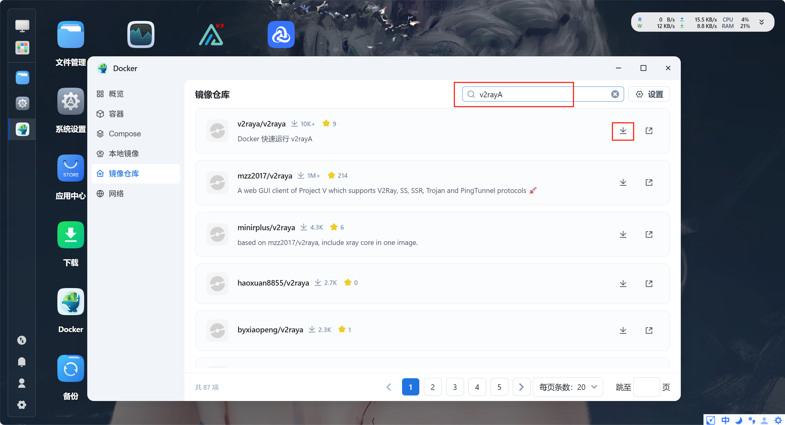

# Docker 部署 v2rayA 代理服务

本文介绍如何在 Docker 环境中部署 v2rayA 代理服务，实现网络代理和流量管理功能。

<!-- more -->

## 简介

v2rayA 是一个支持全局透明代理的 V2Ray 客户端，具有以下特点：

- 🌐 **Web 图形界面**：简洁易用的管理界面
- 🚀 **透明代理**：支持多种代理模式
- 📊 **订阅管理**：支持多个订阅源
- 🔄 **自动更新**：订阅自动更新
- 🎯 **分流规则**：灵活的路由规则

## 前置准备

- 已安装 Docker 环境
- 已安装 1Panel 管理面板（可选）
- 具备有效的代理订阅地址

## 部署步骤

### 步骤一：下载 v2rayA 镜像

在 1Panel 的 **容器 → 镜像** 中搜索并下载 `v2raya` 镜像。



::: tip 提示
推荐使用官方镜像 `mzz2017/v2raya`，版本选择 `latest` 即可。
:::

### 步骤二：启动容器配置

在本地镜像中找到下载的 v2rayA 镜像，点击启动进行配置。


### 步骤三：配置数据持久化

#### 创建存储目录

为了持久化存储配置信息，需要映射容器内的配置目录。

1. 在宿主机创建配置目录（例如：`/opt/v2raya`）
2. 映射容器目录 `/etc/v2raya` 到宿主机目录


::: warning 注意
确保映射的目录有足够的读写权限，否则可能导致配置无法保存。
:::

### 步骤四：赋予高级权限

为了让 v2rayA 能够正常启用代理功能，需要赋予容器特权模式。

在 **功能模块** 中启用 **特权模式**：


::: danger 安全提示
特权模式会给予容器更高的系统权限，仅在必要时启用。生产环境请谨慎使用。
:::

### 步骤五：配置网络模式

将容器网络模式修改为 `host` 模式，以便直接使用宿主机的网络。


**网络模式说明**：
- `host`：容器与宿主机共享网络，性能最佳
- `bridge`：桥接模式，需要端口映射
- `none`：无网络访问

### 步骤六：创建并启动容器

完成上述配置后，点击 **创建** 按钮启动容器。

等待容器状态变为 **Running**，表示启动成功。

## 配置 v2rayA

### 访问管理界面

容器启动成功后，通过浏览器访问管理界面：

```
http://<服务器IP>:2017
```

例如：`http://192.168.1.100:2017`

### 初始化配置

#### 1. 创建管理员账号

首次访问需要创建管理员账号和密码。

::: tip 建议
- 用户名：建议使用复杂的用户名
- 密码：至少 8 位，包含大小写字母和数字
:::

#### 2. 导入订阅地址

在订阅设置页面，粘贴你的订阅链接。


**导入步骤**：
1. 复制订阅提供商给的订阅 URL
2. 点击 **添加订阅**
3. 粘贴订阅地址
4. 点击 **确认** 保存

::: warning 订阅安全
订阅链接包含敏感信息，请勿分享给他人。
:::

#### 3. 配置代理模式

在 **设置** 页面选择合适的代理模式。


**代理模式说明**：

| 模式 | 说明 | 适用场景 |
|------|------|----------|
| **不分流** | 所有流量走代理 | 需要全局代理 |
| **大陆白名单** | 国内直连，国外走代理 | 推荐使用 |
| **GFWList** | 被墙网站走代理 | 精确分流 |
| **绕过大陆** | 国外直连，国内走代理 | 反向代理 |

::: tip 推荐
推荐使用 **大陆白名单模式**，既能保证访问速度，又能正常访问国外网站。
:::

设置完成后，点击 **保存并应用**。

#### 4. 测试节点

测试节点可用性和延迟，选择最优节点。


**测试步骤**：
1. 勾选需要测试的节点（可全选）
2. 点击 **HTTP** 按钮开始测试
3. 等待测试完成，查看延迟信息

**节点状态说明**：
- ✅ **绿色**：节点可用，延迟正常
- ⚠️ **黄色**：节点可用，延迟较高
- ❌ **红色**：节点不可用

#### 5. 启用代理

选择延迟最低的节点，启动代理服务。


**启用步骤**：
1. 点击节点后的 **连接** 按钮
2. 等待连接成功
3. 点击左上角的 **就绪（启动）** 按钮
4. 按钮变为绿色表示代理已启用

## 验证代理

### 检查连接状态

成功启动后，界面应显示 **已就绪** 状态。


### 测试代理功能

访问以下网站验证代理是否生效：

```bash
# 查看当前 IP
curl ip.sb

# 访问 Google（测试）
curl -I https://www.google.com
```

或者直接在浏览器访问 [https://ip.sb](https://ip.sb) 查看当前 IP 地址。


如果显示的 IP 为代理服务器 IP，说明代理配置成功。

## 常见问题

### 1. 无法访问管理界面

**原因**：
- 防火墙未开放 2017 端口
- 容器未成功启动
- 网络模式配置错误

**解决方法**：
```bash
# 检查容器状态
docker ps | grep v2raya

# 查看容器日志
docker logs v2raya

# 开放防火墙端口
firewall-cmd --add-port=2017/tcp --permanent
firewall-cmd --reload
```

### 2. 代理启动失败

**原因**：
- 未启用特权模式
- 订阅节点失效
- 配置文件权限问题

**解决方法**：
- 确认容器特权模式已启用
- 更新订阅，重新测试节点
- 检查配置目录权限：`chmod -R 755 /opt/v2raya`

### 3. 订阅更新失败

**原因**：
- 订阅链接失效
- 网络连接问题
- 订阅服务器限制

**解决方法**：
- 联系订阅提供商获取最新链接
- 手动更新订阅
- 更换其他订阅源

### 4. 部分网站无法访问

**原因**：
- 分流规则配置不当
- 节点被封锁
- DNS 解析问题

**解决方法**：
- 调整分流模式为 **不分流** 测试
- 更换其他节点
- 修改 DNS 为 `8.8.8.8` 或 `1.1.1.1`

## 高级配置

### 自定义路由规则

在 **路由设置** 中可以自定义分流规则：

```json
{
  "domainStrategy": "IPIfNonMatch",
  "rules": [
    {
      "type": "field",
      "domain": ["geosite:cn"],
      "outboundTag": "direct"
    },
    {
      "type": "field",
      "ip": ["geoip:cn", "geoip:private"],
      "outboundTag": "direct"
    }
  ]
}
```

### Docker Compose 部署

使用 Docker Compose 可以更方便地管理：

```yaml
version: '3'

services:
  v2raya:
    image: mzz2017/v2raya:latest
    container_name: v2raya
    restart: unless-stopped
    privileged: true
    network_mode: host
    volumes:
      - /opt/v2raya:/etc/v2raya
    environment:
      - V2RAYA_ADDRESS=0.0.0.0:2017
      - V2RAYA_LOG_LEVEL=info
```

启动命令：
```bash
docker-compose up -d
```

### 开机自启

设置容器开机自启动：

```bash
docker update --restart=always v2raya
```

## 性能优化

### 1. 启用 mKCP

在节点配置中启用 mKCP 协议，提升速度：

```json
{
  "streamSettings": {
    "network": "mkcp",
    "kcpSettings": {
      "uplinkCapacity": 100,
      "downlinkCapacity": 100
    }
  }
}
```

### 2. 启用多路复用

启用 Mux 功能，减少连接数：

```json
{
  "mux": {
    "enabled": true,
    "concurrency": 8
  }
}
```

### 3. DNS 优化

配置智能 DNS 分流：

```json
{
  "dns": {
    "servers": [
      "223.5.5.5",
      "8.8.8.8",
      {
        "address": "1.1.1.1",
        "domains": ["geosite:geolocation-!cn"]
      }
    ]
  }
}
```

## 总结

通过 Docker 部署 v2rayA 具有以下优势：

- ✅ **部署简单**：一键启动，无需复杂配置
- ✅ **管理方便**：Web 界面直观易用
- ✅ **数据持久**：配置信息永久保存
- ✅ **易于迁移**：容器化部署，随时迁移

现在你已经成功部署了 v2rayA 代理服务，可以享受流畅的网络体验了！

---

*标签：Docker, v2rayA, 代理服务, 网络工具, 1Panel*

<ArticleFooter />
